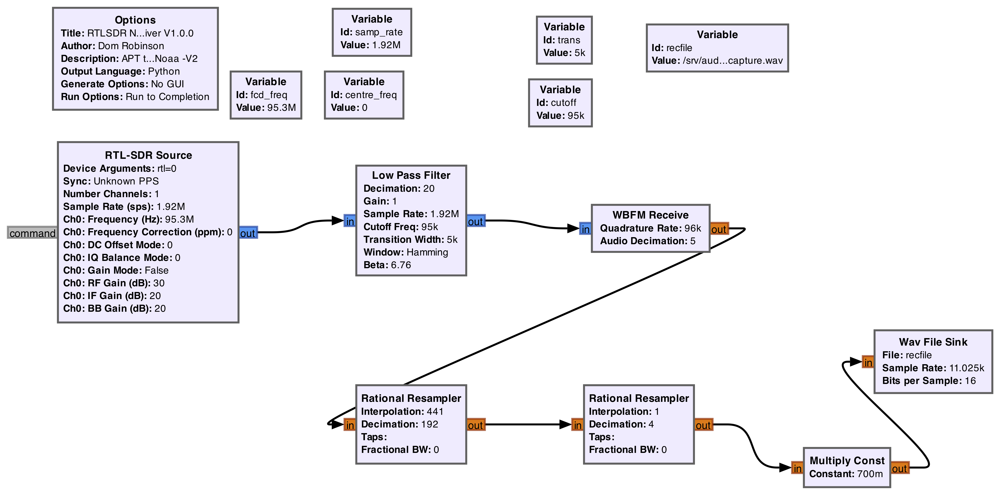
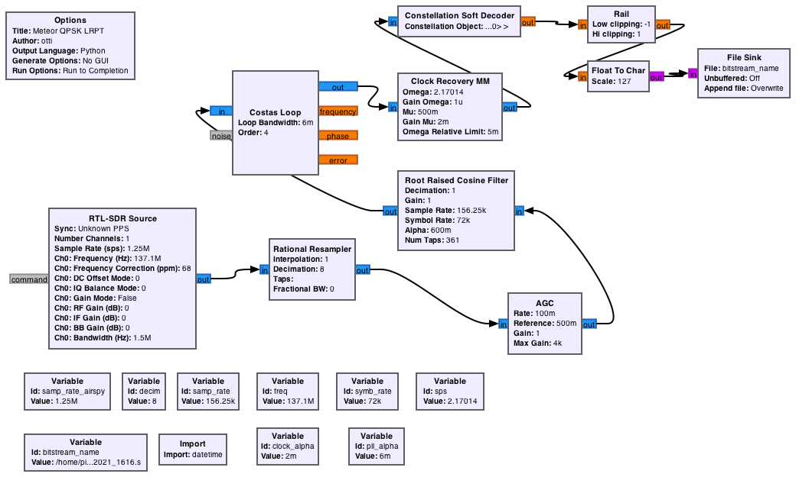

# Notes on version 1.8 - Moving to gnuradio as the default capture processing.

## Background
Historically RN2 used the ```rtl_fm``` code installed as part of the rtl-sdr card driver set to receive  the NOAA APT radio transmissions and capture them as audio wav files. These wav files are subsquently processed by demodulators such as wxtoimg and others to render the final images.

While this has been extremely simple and reliable (since the rtl_fm application is specific to the rtl-sdr cards and since this code is closed-source and proprietary) there has been no way to add other SDR hardware into Raspberry-NOAA-v2 (RN2) workflow without creating significant downstream reengineering requirements.

Since the release of RN2 we have supported Meteor M2 capture and decoding via either ```rtl_fm``` or ```gnuradio``` via control in the settings.

This update introduces the same setting option for NOAA and the  settings.yml.sample now contains that set: 


```
# receiver settings
#   meteor_receiver - which receiver method to use (either 'rtl_fm' or 'gnuradio')
#   noaa_receiver  - which receiver method to use (either 'rtl_fm' or 'gnuradio')
#     **WARNING**: 'gnuradio' does not work with certain SDR devices (e.g. it will not currently
#                  work with a RTL-SDR v3 dongle, as no image will be decoded from the bitstream)
meteor_receiver: 'gnuradio'
noaa_receiver: 'gnuradio'
```

Ultimately for most rtl-sdr users little will change regardless of which setting they use. 

## Developing new hardware hooks with gnuradio
For those who want to try to experiment with other hardware this is a little more information about how you can experiement in gnuradio Composer and create workable ```.py``` scripts that can be used with RN2.

The first thing to explore is the ```raspberry-noaa-v2/scripts/audio_processors/``` folder.

In this folder you will see the following files:

IMPORTANT FILES:
These are the scripts that are called to process files. Edit these with care.

```
meteor_demodulate_qpsk.sh
meteor_record_gnuradio.sh
meteor_record_rtl_fm.sh
noaa_record_gnuradio.sh
rtlsdr_m2_lrpt_rx.py
rtlsdr_noaa_apt_rx.py
```

These files are for information only and may seed your own exploration into creating new versions of ```rtlsdr_m2_lrpt_rx.py``` and ```rtlsdr_noaa_apt_rx.py``` above:

```
rtlsdr_m2_lrpt_rx-nogui.grc
rtlsdr_m2_lrpt_rx-nogui.png
rtlsdr_noaa_apt_rx.grc
rtlsdr_noaa_apt_rx.png
```

The ```.grc``` files are source files that can be opened and explored in gnuradio composer. gnuradio is installed as a prerequisite for RN2 operations, so you already have the app, however if you installed on a 'headless' raspberry pi you will have no way to edit, so it may be that you need to install gnuradio on another machine to explore / edit your own ```.grc``` files. 

The two ```.png``` are rendered below. They are screen grabs from gnuradio composer. 

### Noaa Capture

[[/rtlsdr_noaa_apt_rx.png|NOAA GNURADIO CAPTURE]]


### MeteorM2 Capture

[[/rtlsdr_m2_lrpt_rx-nogui.png|METEOR GNURADIO CAPTURE]]


The images show a visual workflow of what is setup in gnuradio and then exported to ```.py``` files from gnuradio composer.

As you can see in both, the RTL-SDR source block is used as the initial interface to the hardware. This can be replaced in gnuradio, and other hardware can be inserted in place of the RTL-SDR source block. While that change is trivial, given sample rates and channels and so on may be different with other hardware, there will be down stream consequences of making such hardware changes, and adjusting for these to ensure the output wav file is usable by the rest of the processing workflow in RN2 will be down to the user to develop.

Once working manually in gnuradio, the setup can be exported from gnuradio to a ```.py``` python script.

The python script will have a number of variables hard-coded, and so, for example, the satellite frequency and the gain settings will be fixed. This means that the .py files need to be edited in a text editor to replace such parameters with passed-variables from RN2.

For example in ```rtlsdr_noaa_apt_rx.py``` lines 41 to 45 have been added manually after the gnuradio export: These capture variables passed by the ```noaa_record_gnuradio.sh``` script which pass through various settings to be used by the python script as it processes. 

```
    stream_name = sys.argv[1]
	gain = float(sys.argv[2])
	import decimal
	freq = int(decimal.Decimal(sys.argv[3].strip("M"))*decimal.Decimal(1000000))
    freq_offset = int(sys.argv[4])
```

These newly assigned variables (eg 'gain' and 'freq') are then replaced - again manually - through the 'blocks' section of the pt below. 

This means that (for example) line 67 in the ```rtlsdr_noaa_apt_rx.py``` script reads ```self.rtlsdr_source_0.set_gain(gain, 0)``` where the original output from gnuradio would have read ```self.rtlsdr_source_0.set_gain(30.2, 0))```

These changes have to be made manually at this stage. If any reader ever develops a script to parse the default output from gnuradio and replace the correct sections to tie these scripts into the RN2 workflow we would appreciate it!

Note that the .py files may be remarkably different from oneanother if you generate significantly different .grc files as you edit and modify the hardware and wider parts of the workflows.


Good luck - and let us know how you get on!


