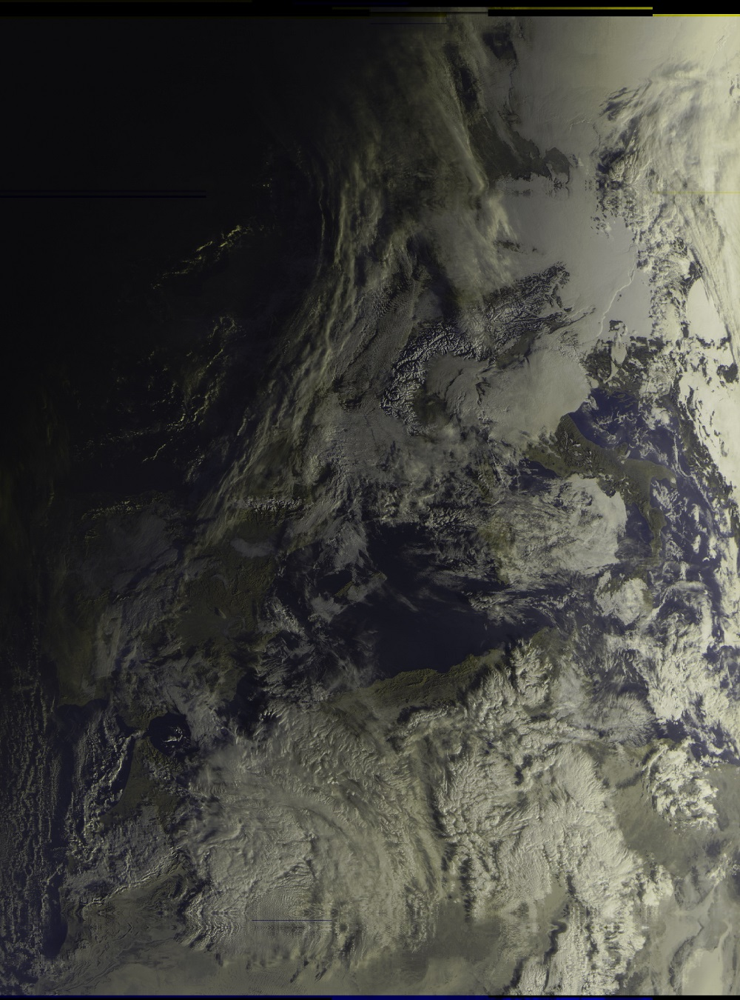
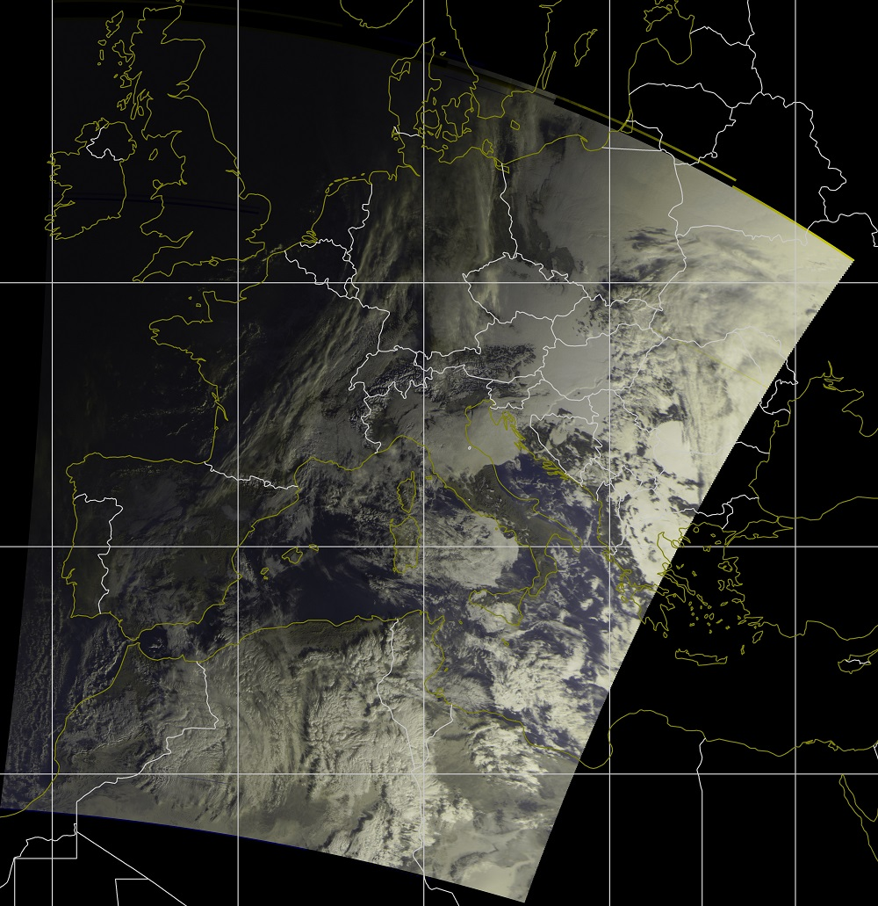
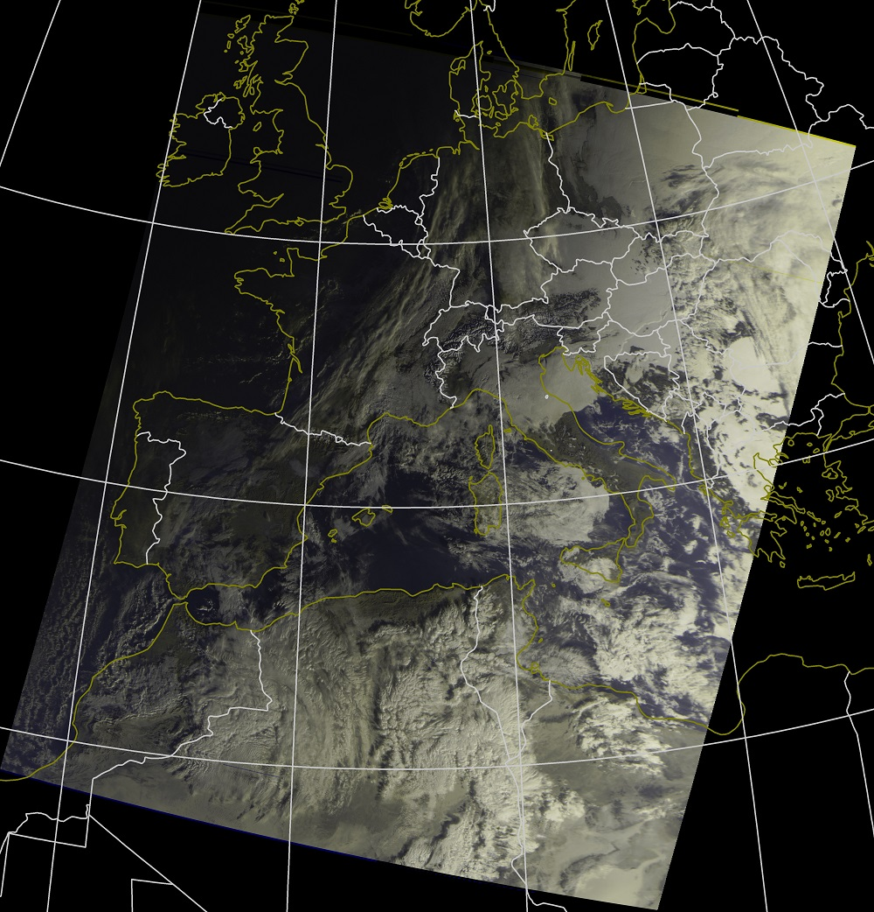
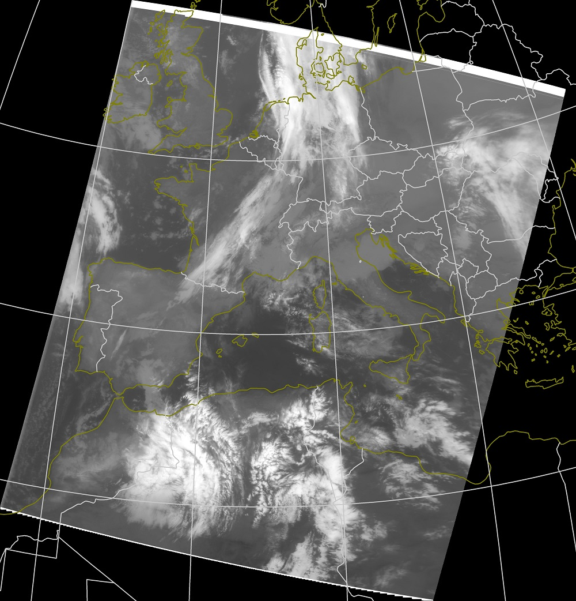
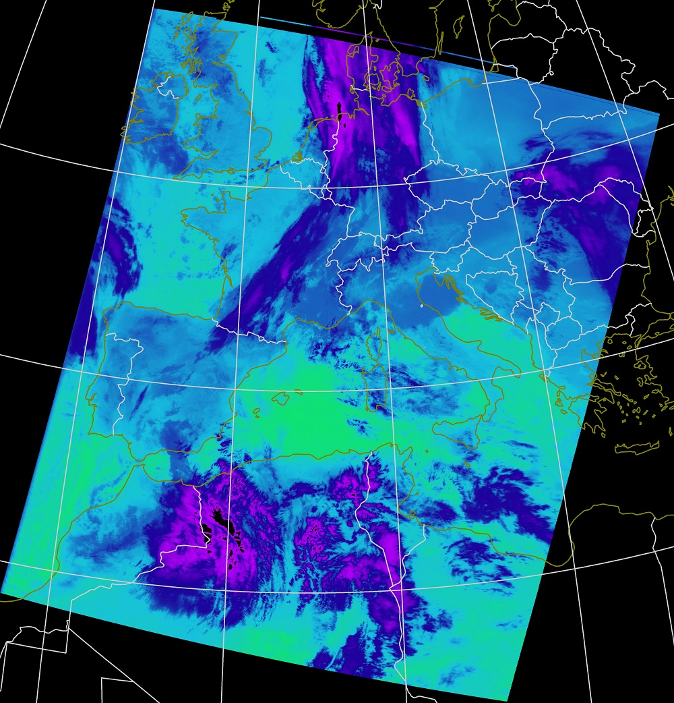

# Meteor Decoder

This project is intended to be a cross platform software to decode METEOR M2 weather satellite data into images. Input file can be ".S" (soft samples) or ".wav" file.
It was created for educational purposes, to learn about satellite communications, how to decode QPSK modulated signals, GIS experiements and all the other stuff that was involved in this project. 

The project is based on 

[http://jmfriedt.free.fr/glmf_meteor_eng.pdf](http://jmfriedt.free.fr/glmf_meteor_eng.pdf)

[https://github.com/infostellarinc/starcoder/tree/master/gr-starcoder/lib/meteor](https://github.com/infostellarinc/starcoder/tree/master/gr-starcoder/lib/meteor)

[https://github.com/artlav/meteor_decoder](https://github.com/artlav/meteor_decoder)

[https://lucasteske.dev/satcom-projects/satellite-projects](https://lucasteske.dev/satcom-projects/satellite-projects)

[https://github.com/dbdexter-dev/meteor_demod](https://github.com/dbdexter-dev/meteor_demod)


Currently supported outputs are raw channel images, RGB images, IR images. Output projection modes are rectified image, Mercator and Azimuthal Equidistant projection.

## Dependencies
OpenCV must be installed on the system. Required OpenCV modules: core, imgcodecs, imgproc

Lots of people struggling with compiling openCV on Raspberry Pi. Here is the commands that I've tested on Raspbian:

(Don't forget to ```sudo apt-get update``` to ensure you can install cmake properly).

```
sudo apt install python3-dev python3-pip
sudo apt install cmake build-essential pkg-config git
sudo apt install libatlas-base-dev liblapacke-dev gfortran
git clone https://github.com/opencv/opencv.git
cd opencv/
cmake ../  -DBUILD_LIST=core,imgproc,imgcodecs -DCMAKE_INSTALL_PREFIX=/usr/local -DBUILD_TESTS=OFF -DBUILD_EXAMPLES=OFF -DCMAKE_SHARED_LINKER_FLAGS=-latomic
make -j4
sudo make install
```

The other two dependencies can be downloaded from git with command:

```git submodule update --init --recursive ``` 


## Build and install
For the development QT creator is used, but the qmake is maintained only for windows.

CMAKE is the build system to compile the project. Tested on Windows and Linux(ubuntu, raspbian)

```
git clone https://github.com/Digitelektro/MeteorDemod.git
cd MeteorDemod
git submodule update --init --recursive
mkdir build && cd build
cmake ../
make
sudo make install
```

## Usage
Input parameters:

-t --tle        Two-line element set (TLE) file for calculating overlays

-i --input      Input *.S file or *.wav

-o --output     Optional, folder where generated files will be saved

-f --format     Optional, format of the output images (jpg, bmp, png), default: bmp

-d --date       Optional, specify date for decoding older files (format: dd-mm-yyyy)

Other settings can be found in the settings.ini file.


## Development
Master branch is for the latest stable version, beta branch for beta versions, development is ongoing on other branches.

## Future developments
 - More precise image overlays
 - Rain overlay
 - Composite output from multiple passes
 - Support dead Meteor M2 2 satellite (it may be required for future satellites)
 - Multithreading, faster image processing
 
 
## Example Outputs

### Spreaded Image



### Mercator projection



### Azimuthal Equidistant projection



### IR Image



### Temperature Image


